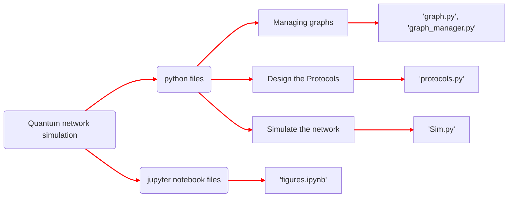

#   **Process update for third-year project**

+ #### What did i do this week?
I've went through part of the Natasha's code and prepare for the presentation.  
    ps: most of time working on preparaing this 'document'

+ ###  what will i do next week?
I will presist in playing around with Natasha's code.

+ ###  what will i mention in this 'report'?
Explain the main function and aim of the files by talking about the input, output and a little bit more about process

+ ### A brief summary of current work
Those files are just libraries for self-defined functions. There are ten files in total, but i haven't went through all of them. I only have a look at 'py' files but no '.ipynb' files. So only '.py' files will be covered in the report.

>_Here is a flowchart shwoing the aim for each '.py' file_ 

<!---->

