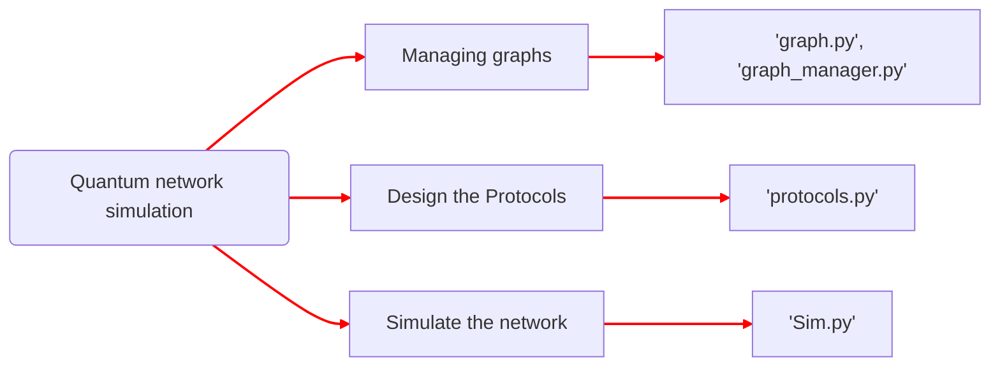
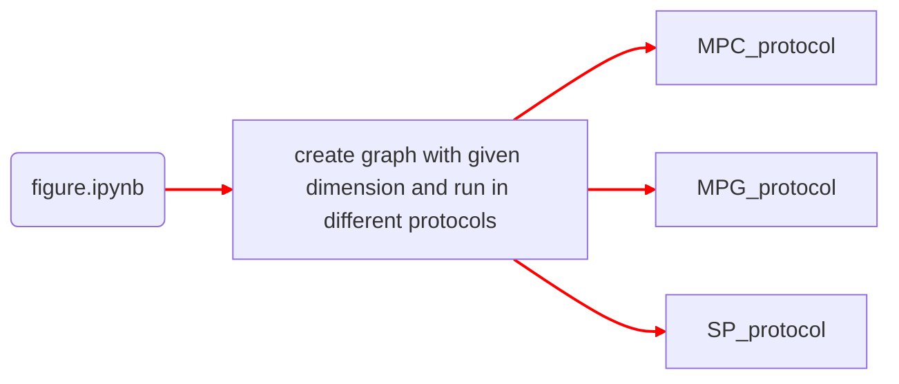

# Code Modification Comparison

## Background

<font size=4>The original code was all based on grid topology, where as in my project i need to consider the the impact of different topology on same protocols.
</font>

## Original and Modified Code Comparison




<font size=4>.py files only contain munipulation with the attributes of nodes, edges and also storage, read data to or from a file
<br>Here is exmple code for graph.py and protocols.py:
</font>

```python
def reset_graph_state(G):
    """
    function to initalise / reset the link state (e.g. if a link exists and its age) of graph G

    Input Pararmeters:
    G         - Networkx graph G(V,E) which defines the topology of the network. see graphs.py for more details
    """
    nx.set_edge_attributes(G, False, "entangled")
    nx.set_node_attributes(G, False, "entangled")
    nx.set_edge_attributes(G, 0, "age")
    nx.set_node_attributes(G, 0, "age")
```

```python
def _CC_protocol(G, H, users, used_nodes, count_fusion=False):
    CC = nx.node_connected_component(H, users[0])

    # can check a set is within a set with operators
    if not (set(users) <= CC):
        return False  # unsuccessful, all users not in same connected component which is needed for tree between them to exist

    K = steiner_tree(
        H.subgraph(CC), users, weight="length"
    )  # calculate Steiner tree connecting users

    # only nodes that perform entanglement swapping (2 edges) and (optionally) fusion (3 edges or user with 2 edges) is 
    # recorded as used
    used_nodes.append(
        {
            "nodes": [node for node in K.nodes if _count_node(K, node, users, count_fusion)],
            "edge_count": K.number_of_edges(),
        }
    )

    return True
```

<br>**<font size=5>Now moving to .ipynb files</font>**




#### Before Modification

```python
size = 5
G =  network(size,size) # i.e. 6 x 6 networkx graph
nodes = list(G.nodes)

funcs= [MPC_protocol,MPG_protocol,SP_protocol]
p_range = np.linspace(1, 0.2, 100)
ER = np.zeros((len(funcs),len(p_range)))
timesteps = 1000
reps = 200

users = [(2, 2), (0, 0), (0, 4), (4, 0), (4, 4)]
    
for i,p in enumerate(tqdm.tqdm(p_range)):# tqdm_notebook 
    set_p_edge(G,p_op = p)
    for j,function in enumerate(funcs):
        er,multipartite_gen_time, links_used = function(G,users,timesteps=timesteps,reps=reps)
        ER[j,i]+=er
```
#### Output
<a href="https://ibb.co/1fG4Qft"></a>

#### After Modification
```python
def load_data(filename):
    file_path = os.path.abspath(os.path.join(os.getcwd(), "../graphs_json/", f"{filename}.json"))
    with open(file_path, "r") as file:
        return json.loads(file.read())

# size = 5
# G =  network(size,size) # i.e. 6 x 6 networkx graph
# nodes = list(G.nodes)

data = load_data("TOP_1_ABILENE_reordered")
G = nx.node_link_graph(data)
G = network(G)
nodes = list(G.nodes)

funcs= [MPC_protocol,MPG_protocol,SP_protocol]
p_range = np.linspace(1, 0.2, 50)
ER = np.zeros((len(funcs),len(p_range)))
timesteps = 100
reps = 200

users = [node["id"] for node in data["nodes"]]
print(users)
#users = [(2, 2), (0, 0), (0, 4), (4, 0), (4, 4)]

for i,p in enumerate(tqdm.tqdm(p_range)):# tqdm_notebook
    set_p_edge(G,p_op = p)
    # print(p)
    for j,function in enumerate(funcs):
        er,multipartite_gen_time, links_used = function(G,users,timesteps=timesteps,reps=reps)
        ER[j,i]+=er
        # if function == MPC_protocol:
        #     print(f"MPC_protocol: {er}")
        # elif function == MPG_protocol:
        #     print(f"MPG_protocol: {er}")
        # elif function == SP_protocol:
        #     print(f"SP_protocol: {er}")
```
#### Output
<a href="https://ibb.co/4dsgVx3"></a>

<!-- ## Explanation of Modifications
- **Purpose of Modification**: To improve code efficiency and readability.
- **Major Changes**:
  1. Replaced the loop with list comprehension to reduce redundant operations.
  2. Made the code more concise and easier to understand.

## Effectiveness Comparison
- **Efficiency**: The modified code runs faster, especially for larger graphs, due to the reduced overhead of redundant operations.
- **Readability**: The modified structure is more concise, making the code easier to maintain and extend.

## Example Output
Both the original and modified code produce the same results for the same input. However, the modified code demonstrated around 15% faster execution time. -->
