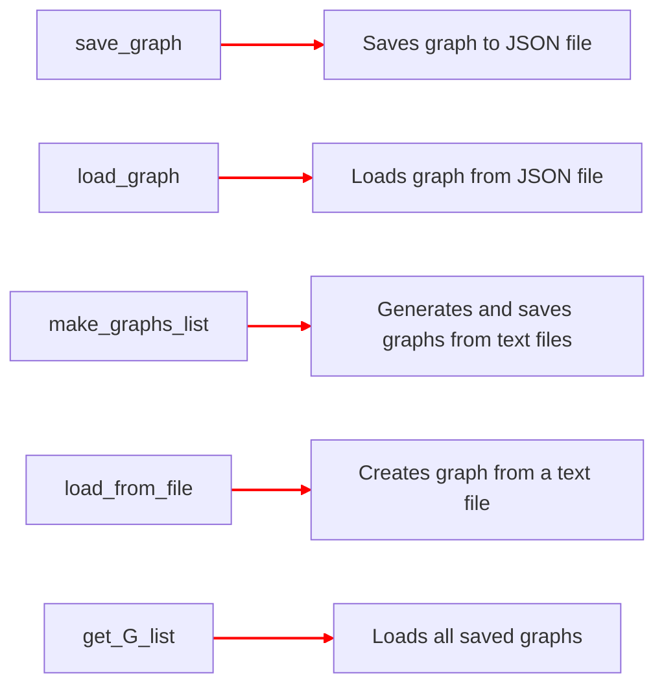

# <font size=7>**graph_manager.py**</font>

> <font size=4>Function to manage the graph of whole network.</font>

# <font size=5>Input:</font>
+ <font size=4>Graph G, graph filename name, list of file paths, etc.</font>

# <font size=4>Output:</font>
+ <font size=4>Saved graph files, loaded graph objects, updated parameters, and lists of graphs.</font>
+ <font size=4>Updated used_nodes list.</font>

# <font size=4>Process:</font>
+ <font size=4> save_graph saves the graph as a JSON file.</font>
+ <font size=4> load_graph loads a graph from a JSON file.</font>
+ <font size=4> make_graphs_list generates graphs from .txt files and saves them.</font>
+ <font size=4> load_from_file reads graph data from a .txt file and creates a NetworkX graph.</font>
+ <font size=4> get_G_list loads all saved graphs from the graphs folder.</font>






```mermaid 
flowchart LR
    A[Load Topology Bench dataset Class 0/1/2]
    B[For each topology:Generate all 3-user groups]
    C[For each group:Run MP-C, MP-G, SP]
    D[For each protocol:Sweep p from 0.2 to 1.0, 50 steps]
    E[For each p:Run 100 Monte Carlo trials]
    F[Compute ER → Average ER → SR]
    G[Average SR over all groups to get final SR per topology]
    H[Use SRs for analysis:Clustering, correlation]

    A --> B 
    B --> C 
    C --> D 
    D --> E 
    E --> F 
    F --> G 
    G --> H
    linkStyle default stroke:#ff0000,stroke-width:2px;
```

```python
import networkx as nx

from graph import network, reset_graph_state, update_graph_params
from networkx.generators import *
from networkx.readwrite import json_graph
import json
import os
import csv


def save_graph(G, name="tree"):
    """
    Save Networkx graph as json object in graphs folder

    Input Pararmeters:
    G    - Networkx graph G(V,E) which defines the topology of the network. see graphs.py for more details
    name - graph filename
    """
    with open("graphs//" + name + ".json", "w") as outfile1:
        outfile1.write(json.dumps(json_graph.node_link_data(G)))
    #   Store the graph to address "graphs//" + name + ".json"
    #   json_graph.node_link_data(G) convert information about edge and node into dictionary, whcih then able to be serialize
    #   json.dumps() convert python data type like dictionary into string in json data type
    #   outfile1.write() write the converted json data into file


def load_graph(filename):
    """
    load Networkx graph as json object in graphs folder

    Input Pararmeters:
    filesname - graph filename (.json file only) (name excluding directory or ".json")

    Outputs:
        G        - Networkx graph G(V,E) which defines the topology of the network. see graphs.py for more details
    """
    with open("graphs//" + filename + ".json", "r") as f:
        js_graph = json.loads(f.read())
    return json_graph.node_link_graph(js_graph)
    #   f.read() read the information included in the file 
    #   json.loads() convert the json string into python data type like dictionary
    #   json_graph.node_link_graph() convert the python dictionary back into Network X graph object


def make_graphs_list():
    """
    create Networkx json graphs from .txt files in graphs folder
    Note:
    Also create 6x6 grid graph
    initialise p and Qc as 1
    """
    current_directory = os.getcwd()
    #   Obtain the current working address

    graphs_dir = os.path.join(current_directory, "graphs")
    #   Join the current path with "graphs" and obtain the address to store graphs

    G = network(6, 6)
    update_graph_params(G, p=1, Qc=1)  # initalise p,Qc as 1
    save_graph(G, "grid_6_6")
    #   Create a new 6x6 grid graph and save it into the file

    for file in [file for file in os.listdir(graphs_dir) if file.endswith(".txt")]:
        #   os.listdir(graphs_dir) returns the list the contain all files in the graphs folder
        #   file for file in os.listdir(graphs_dir) if file.endswith(".txt") filt out all txt file 
        print(os.path.join(graphs_dir, file))
        #   Show the current path
        file_name = file.split("\\")[0]
        #   split the path and get the file name
        G = load_from_file(file=file_name)
        #   Read the file
        nom = file_name[:-4]
        #   Remove the '.txt' from the file name
        update_graph_params(G, p=1, Qc=1)  # initalise p,Qc as 1
        save_graph(G, name=file_name)


def load_from_file(file="UKnet.txt"):  # could be done better?
    """
    load Networkx graph from file in graphs folder

    Input Pararmeters:
    file - graph filename (.txt file only)

    Outputs:
        G   - Networkx graph G(V,E) which defines the topology of the network. see graphs.py for more details
    Note:
    initialise p and Qc as 1
    """
    current_directory = os.getcwd()
    graphs_dir = os.path.join(current_directory, "graphs")
    title = True
    data = []
    with open(graphs_dir + "/" + file, encoding="ISO-8859-1") as csv_file:
        #   combine the address and then open it
        csv_reader = csv.reader(csv_file, delimiter="\t")
        #   read the file and assign to csv_reader
        for row in csv_reader:
        #   
            if title:
                title = False
            else:
                data.append(
                    (int(row[0]), int(row[1]), float(row[2]) / 100)
                )  # note dividing km by 100 for the length
    G = nx.Graph()
    for x in data:
        G.add_edge(str(x[0]), str(x[1]), length=x[2])
    update_graph_params(G, p=1, Qc=1)  # default p,Qc as 1
    reset_graph_state(G)  # initalise link data
    return G


def get_G_list():  # Load saved topologies from graphs folder
    """
    load all Networkx graphs from file in graphs folder

    Outputs:
    G_list          - List of Networkx graphs G(V,E) which defined from txt files in 'graphs' folder (+ grid graph)
    name_list_clear - List of Names of graphs in folder (hardcoded)
    Note:
    initial p and Qc set to 1
    """
    name_list_clear = ["ARPA", "EON", "Eurocore", "NSFnet", "UKnet", "USnet", "Grid"]
    # Create list of graphs G
    G_list, name_list = [], []
    current_directory = os.getcwd()
    graphs_dir = os.path.join(current_directory, "graphs")
    for file in os.listdir(graphs_dir):
        if file.endswith(".txt"):
            file_name = file.split("\\")[0]
            G = load_from_file(file=file_name)
            G_list.append(G)
            name_list.append(file_name[:-4])
    G_list.append(load_graph("grid_6_6"))
    name_list.append("grid_6_6")
    return G_list, name_list_clear

```
